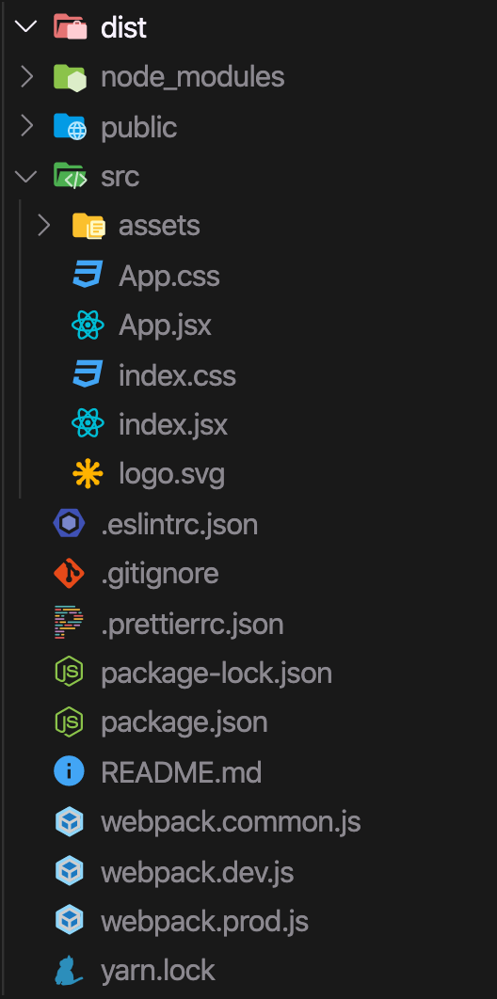

# Webpack React Boilerplate


## Structure



## Usage

1. Clone repository

```
  git clone https://github.com/chnirt/webpack-react-boilerplate
```

2. Cd into directory

```
  cd webpack-react-boilerplate/
```

3. Install dependencies using npm

```
  npm i
```

4 Start

```
  PORT=<yourport> npm run start
```

## Source
- Config webpack: https://webpack.js.org/guides/

- Not use RHL: https://blog.isquaredsoftware.com/2017/08/blogged-answers-webpack-hmr-vs-rhl/